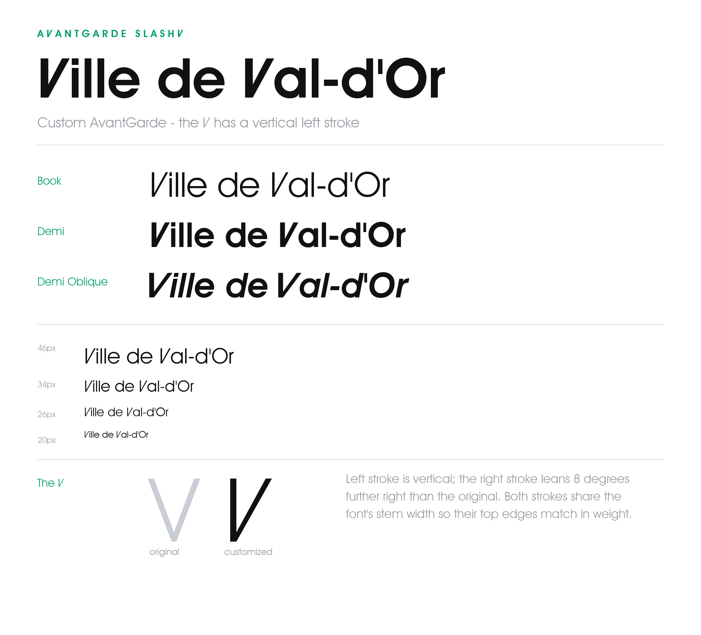
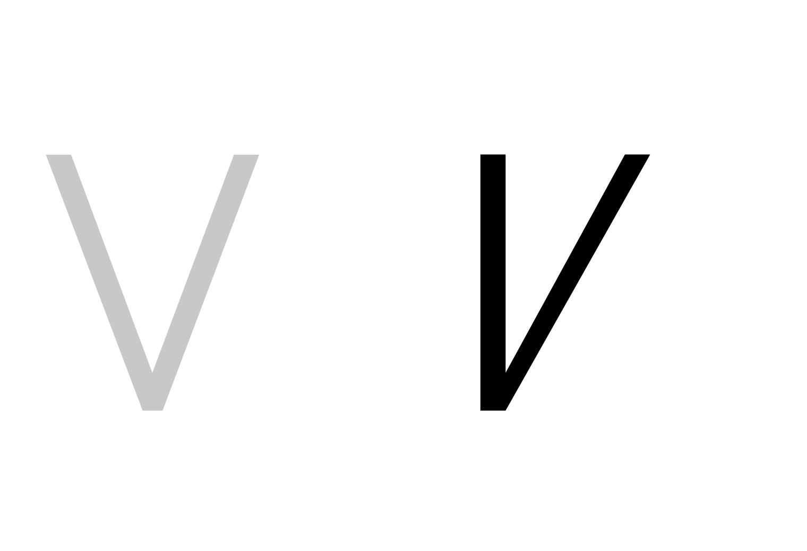

# avantgarde-vvd

Outil Python qui modifie **AvantGarde Bk BT** pour que le **V** majuscule
suive le logotype de la Ville de Val-d'Or : un trait gauche **vertical**
joint à une diagonale inclinée vers la droite.



## Ce que ça fait

Dans la police d'origine, les deux bras du **V** sont en diagonale. Cet outil
réécrit le glyphe `V` ainsi :

- le **trait gauche est vertical** (graisse calquée sur le `I` de la police)
- le **trait droit conserve son angle montant**, légèrement accentué vers la droite
- les deux traits ont la même largeur en tête et se rejoignent en un seul V

La famille générée s'appelle **AvantGarde SlashV**, pour cohabiter avec
l'AvantGarde d'origine. Trois styles sont produits :

| Fichier source  | Style         | Sortie                              |
| --------------- | ------------- | ----------------------------------- |
| `AVGARDN.TTF`   | Book          | `fonts/AvantGardeSlashV-Book.ttf`   |
| `AVGARDD.TTF`   | Demi          | `fonts/AvantGardeSlashV-Demi.ttf`   |
| `AVGARDDO.TTF`  | Demi Oblique  | `fonts/AvantGardeSlashV-DemiOblique.ttf` |



## Prérequis

- Python 3.10+
- [fontTools](https://github.com/fonttools/fonttools) et [Pillow](https://python-pillow.org) (pour les images d'aperçu)
- Une copie **licenciée** d'AvantGarde Bk BT installée sur la machine
  (Book / Demi / Demi Oblique — en général `AVGARDN.TTF`, `AVGARDD.TTF`,
  `AVGARDDO.TTF` dans le dossier des polices utilisateur Windows)

```bash
pip install -r requirements.txt
```

## Utilisation

Générer les polices modifiées (lit les fichiers AvantGarde installés, écrit
dans `fonts/`) :

```bash
python scripts/make_font.py
```

L'inclinaison du trait droit est réglée par `EXTRA_ANGLE` en tête de
`scripts/make_font.py` (actuellement `+8` degrés par rapport à l'original).

### Installation sous Windows

```powershell
powershell -ExecutionPolicy Bypass -File scripts/install_fonts.ps1
```

Installe pour l'utilisateur courant (pas besoin d'admin). Redémarrez les
applications qui avaient déjà chargé la police pour qu'elles prennent les
nouveaux fichiers.

### Images d'aperçu

```bash
python scripts/demo.py            # feuille d'échantillon complète
python scripts/preview.py         # original vs personnalisé, toutes les graisses
python scripts/angle_options.py   # comparaison des inclinaisons du trait droit
```

Les PNG sont enregistrés dans `images/`.

## Structure du projet

```
fonts/          TTF générés (livrable — ne pas redistribuer)
scripts/        Générateur, installateur Windows, rendu des aperçus
images/         Aperçus PNG pour le README
```

## AvantGarde Bk BT

**AvantGarde Bk BT** est la version Bitstream (BT = Bitstream) de l'ITC
Avant Garde Gothic graisse Book (Bk = Book), une sans empattement géométrique
dessinée à l'origine par Herb Lubalin. C'est une **police commerciale
propriétaire**, ni libre ni open source — copyright Bitstream Inc. / Monotype,
tous droits réservés. Elle ne peut être utilisée à des fins commerciales
qu'avec une licence achetée, et est disponible sur fonts.com ou myfonts.com.
Elle ne peut pas être légalement regroupée, redistribuée ou intégrée sans la
licence adéquate ; les conditions varient selon l'usage (bureau, web,
application ou livre numérique).

⚠️ De nombreux sites (blogfonts, font.download, cufonfonts, onlinewebfonts) la
proposent en « téléchargement gratuit », mais ce ne sont **pas des sources
légitimes** — la police est protégée par le droit d'auteur et commerciale, et
la redistribution gratuite n'est pas autorisée.

### Où l'acquérir

- [MyFonts](https://www.myfonts.com) — marketplace Monotype (vérifier l'EULA et le tarif en vigueur)
- [Fonts.com](https://www.fonts.com) — propose aussi le catalogue Bitstream

## Licence

AvantGarde Bk BT est une **police commerciale propriétaire**. Vous devez déjà
posséder une licence valide pour l'utiliser. Les polices produites par cet
outil sont des **œuvres dérivées** de cette fonte — **réservez-les à un usage
interne et ne les redistribuez pas**. Ne déposez pas les TTF générés dans un
dépôt public si votre licence l'interdit.

Le code de ce dépôt est sous licence MIT. Cela couvre uniquement les scripts,
pas la police qu'ils modifient ni les fichiers qu'ils produisent.

## Avertissement

Ce projet a été réalisé avec l'aide de **Cursor Pro+**.
