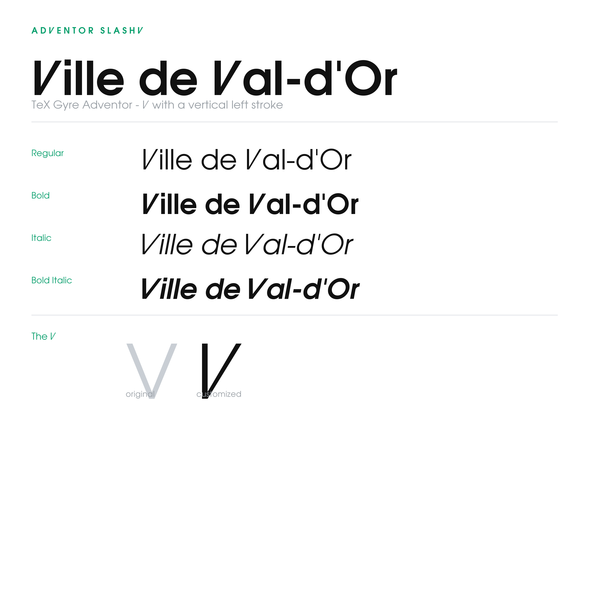

# avantgarde-vvd

Outil Python qui réécrit le **V** majuscule pour suivre le logotype de la
Ville de Val-d'Or : un trait gauche **vertical** joint à une diagonale
inclinée vers la droite.

Deux familles sources sont prises en charge :

| Source | Famille générée | Licence source |
| ------ | --------------- | -------------- |
| **AvantGarde Bk BT** | AvantGarde SlashV | propriétaire (Bitstream / Monotype) |
| **TeX Gyre Adventor** | Adventor SlashV | GUST Font License (LPPL) |




## Ce que ça fait

Dans les polices d'origine, les deux bras du **V** sont en diagonale. Cet outil
réécrit le glyphe `V` ainsi :

- le **trait gauche est vertical** (graisse calquée sur le `I` de la police)
- le **trait droit conserve son angle montant**, légèrement accentué vers la droite
- les deux traits ont la même largeur en tête et se rejoignent en un seul V

### AvantGarde SlashV

| Fichier source | Style | Sortie |
| -------------- | ----- | ------ |
| `AVGARDN.TTF` | Book | `fonts/AvantGardeSlashV-Book.ttf` |
| `AVGARDD.TTF` | Demi | `fonts/AvantGardeSlashV-Demi.ttf` |
| `AVGARDDO.TTF` | Demi Oblique | `fonts/AvantGardeSlashV-DemiOblique.ttf` |

### Adventor SlashV

| Fichier source | Style | Sortie |
| -------------- | ----- | ------ |
| `texgyreadventor-regular.otf` | Regular | `fonts/AdventorSlashV-Regular.ttf` |
| `texgyreadventor-bold.otf` | Bold | `fonts/AdventorSlashV-Bold.ttf` |
| `texgyreadventor-italic.otf` | Italic | `fonts/AdventorSlashV-Italic.ttf` |
| `texgyreadventor-bolditalic.otf` | Bold Italic | `fonts/AdventorSlashV-BoldItalic.ttf` |

Les OTF Adventor (CFF) sont convertis automatiquement en TrueType avant
modification.

## Prérequis

- Python 3.10+
- [fontTools](https://github.com/fonttools/fonttools) et [Pillow](https://python-pillow.org)

```bash
pip install -r requirements.txt
```

**AvantGarde** (propriétaire) : placer vos fichiers licenciés dans
`source/avantgarde/`. À défaut, le script cherche dans les polices utilisateur
Windows.

**Adventor** : déjà fourni dans `source/tex-gyre-adventor/` (licence GUST).

## Utilisation

Double-clic Windows (à la racine du dépôt) :

| Fichier | Action |
| ------- | ------ |
| `build_and_install.bat` | **Un clic** : génère puis installe les deux familles |
| `build.bat` | Génère les TTF dans `fonts/` |
| `install.bat` | Installe les TTF pour l'utilisateur Windows courant |
| `make_demos.bat` | Régénère les PNG dans `images/` |

En ligne de commande :

```bash
python scripts/make_font.py              # les deux familles
python scripts/make_font.py avantgarde   # AvantGarde seulement
python scripts/make_font.py adventor     # Adventor seulement
```

Sortie très détaillée par défaut (DEBUG). Mode court : `-q`.
Inclinaison : `--angle 8`.

### Installation sous Windows

```powershell
powershell -ExecutionPolicy Bypass -File scripts/install_fonts.ps1
powershell -ExecutionPolicy Bypass -File scripts/install_fonts.ps1 -Family Adventor
```

### Images d'aperçu

```bash
python scripts/demo_avant_garde.py
python scripts/demo_adventor.py
python scripts/preview.py
python scripts/angle_options.py
```

## Structure du projet

```
source/avantgarde/           AvantGarde d'origine (*.ttf gitignorés)
source/tex-gyre-adventor/    TeX Gyre Adventor + licence GUST
fonts/                       TTF générés
scripts/                     Générateur, installateur, aperçus
images/                      PNG pour le README
```

## AvantGarde Bk BT

**AvantGarde Bk BT** est la version Bitstream de l'ITC Avant Garde Gothic Book,
une sans empattement géométrique de Herb Lubalin. Police **commerciale
propriétaire** — copyright Bitstream Inc. / Monotype. Utilisation commerciale
uniquement avec licence achetée (MyFonts, Fonts.com).

⚠️ Les sites proposant un « téléchargement gratuit » ne sont **pas légitimes**.

## TeX Gyre Adventor

**TeX Gyre Adventor** est une reprise libre (GUST e-foundry) de la famille
URW Gothic / Avant Garde. Distribuée sous la **GUST Font License** (LPPL). Les
œuvres dérivées doivent être renommées — d'où **Adventor SlashV**.

## Licence

- **Code** (scripts) : MIT.
- **AvantGarde SlashV** : œuvre dérivée d'une police propriétaire — usage
  interne seulement, **ne pas redistribuer**.
- **Adventor SlashV** : dérivée sous GUST/LPPL, redistribuable si le nom
  reste distinct de TeX Gyre Adventor (déjà le cas).

## Avertissement

Ce projet a été réalisé avec l'aide de **Cursor Pro+**.
